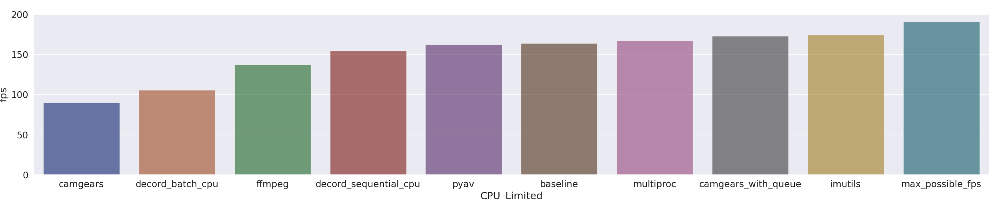

~~~~# Benchmarking Video Reading

Tested using Python 3.7.0 on Ubuntu 20.04 LTS with Intel(R) Core(TM) i7-7700HQ CPU @ 2.80GHz (4-core, 8-thread CPU)   

Hard disk: Sequential Read - 560 MB/s CT2000MX500SSD1 Crucial MX500 2TB 3D NAND SATA 2.5 inch 7mm (with 9.5mm adapter) Internal SSD

## How To Run 

`git lfs pull` # to get video

`pip install requirements.txt`

`pip install -e setup.py`

## Output

Timings can be found in the ./timings folder.

Timings are reported over 1000 frames as `time_for_all_frames` (seconds) +/- `stddev_for_all_frames` (seconds)  with this standard deviation calculatied over 3 repeats. `time_per_frame` is calculated as `time_for_all_frames`/1000 and the FPS is calculated as 1/`time_per_frame`.

## To Do

Look into https://medium.com/@haydenfaulkner/extracting-frames-fast-from-a-video-using-opencv-and-python-73b9b7dc9661 ...their CV2 implementation relies on the .set method of cv2.VideoCapture which is buggy https://github.com/opencv/opencv/issues/9053 unless one works around it with something like https://gist.github.com/bml1g12/e1e0af85e49bf46cccddbcf8e68a3708 I believe.

Decord however looks very promising; and even has inbuilt bridges to numpy, PyTorch Tensor and Tensorflow Tensor. https://github.com/dmlc/decord#bridges-for-deep-learning-frameworks 

Try PyAV  https://pyav.org/docs/develop/
